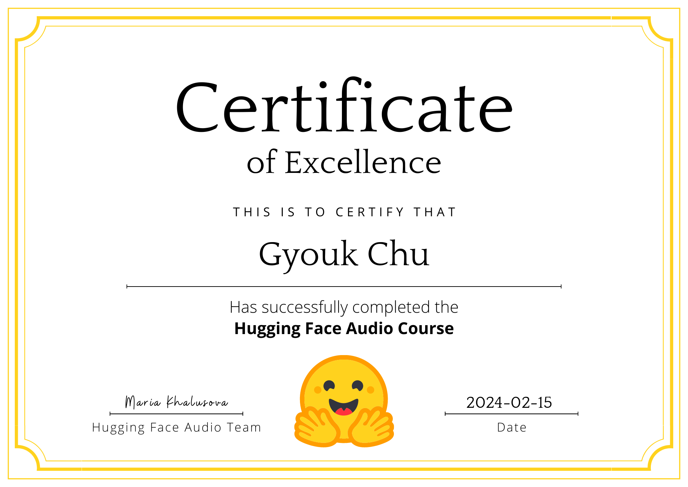

# Certificate

# Hugging Face Audio Course

Check out my Speech-to-speech translation (in French) model: [STST](https://huggingface.co/spaces/ChuGyouk/speech-to-speech-translation)

## Unit 1: Working with Audio Data

- Introduction to audio data (time domain, frequency domain, (log-mel) spectrogram)
- Load and explore an audio dataset (🤗 Datasets library)
- Preprocessing audio data (resampling with 🤗 Datasets’ cast_column function & Audio module, filtering the dataset, pre-processing with 🤗 Transformers AutoFeatureExtractor/AutoProcessor)
- Streaming audio data

## Unit 2: A Gentle Introduction to Audio Applications

- Audio classification with a pipeline (🤗 Transformers pipeline)
- Automatic speech recognition with a pipeline
- Audio generation with a pipeline
- Hands-on exercise (ungraded)

## Unit 3: Transformer Architectures for Audio
- Refresher on transformer models (Waveform (Wav2Vec2, HuBERT/None) or Spectrogram (Whisper/SpeechT5) input/output)
- CTC (Connectionist Temporal Classification) architectures (CTC algorithm, Wav2Vec2, HuBERT, M-CTC-T)
- Seq2Seq architectures (Whisper, SpeechT5)
- Audio classification architectures (Audio Spectrogram Transformer)

## Unit 4: Build a Music Genre Classifier
- Pre-trained models for audio classification (Keyword Spotting, Language Identification, 0-shot Audio Classification w/ CLAP)
- Fine-tuning a model for music classification (DistilHuBERT on GTZAN dataset)
- Build a demo with Gradio
- Hands-on exercise (Graded)

## Unit 5: Automatic Speech Recognition
- Pre-trained models for automatic speech recognition (Limitations of CTC, Graduation to Seq2Seq, especially Whisper)
- Choosing a dataset (Summary of popular datasets, [link](https://huggingface.co/blog/audio-datasets#a-tour-of-audio-datasets-on-the-hub))
- Evaluation and metrics for speech recognition (Word Error rate (WER))
- How to fine-tune an ASR system with the Trainer API (Whisper on Common Voice 13 Dhivehi data, note for the Data Collator and evaluation metrics)
- Build a demo
- Hands-on exercise (Graded)

## Unit 6: From Text to Speech
- Text-to-speech datasets (LJSpeech, Multilingual LibriSpeech, VCTK, LibriTTS)
- Pre-trained models for text-to-speech (SpeechT5 w/ HifiGAN, Bark, Massive Multilingual Speech (MMS))
- Fine-tuning SpeechT5
- Evaluating text-to-speech models
- Hands-on exercise (Graded)

## Unit 7: Putting It All Together
- Speech-to-speech translation (Speech translation -> text-to-speech)
- Creating a voice assistant (Wake word detection -> Speech transcription -> Language model query -> Synthesise speech)
- Transcribe a meeting (Speaker diarization)
- Hands-on exercise (Graded)